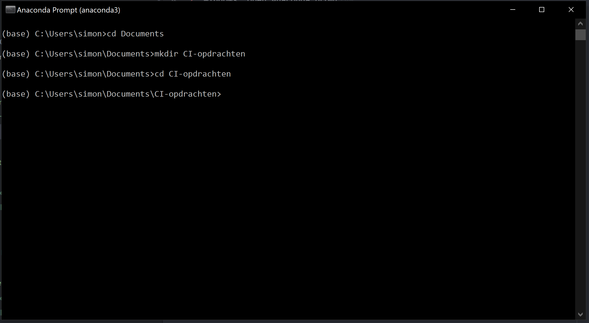

# Installeren

Voor dit vak maken we gebruik van Python 3.9, Jupyter Notebooks, Anaconda en een aantal nuttige Python packages. Volg deze installatieinstructies om ervoor te zorgen dat alles goed klaarstaat.

Volg de onderstaande instructies **ook als je al Python op je computer hebt staan**. Er zijn vakspecifieke onderdelen.

## Stap 1: Installeer Anaconda

Als je een recente versie van Anaconda hebt kan je deze stap overslaan.

Dit pakket kunt je downloaden op de website van [Anaconda](https://www.anaconda.com/distribution/). Kies daar voor de laatste Python 3.x versie voor jouw besturingssysteem.

Let op! Tijdens de installatie op Windows vraagt de installer of Anaconda toegevoegd moet worden aan de PATH variabele. Klik dit vinkje aan:

Zodra de download klaar is, moet je het gedownloade bestand uitvoeren. Volg dan de installatieinstructies, als het goed is hoef je verder niks te veranderen.

## Stap 2: Open een terminal.

Onder windows is het het makkelijkste om gebruik te maken van de Anaconda Prompt. Voor MacOS en Linux kan je de inebouwde terminal gebruiken.

In de terminal, navigeer naar een directory waar je je opdrachten gaat maken.

## Stap 3: Download CI environment

1. (Deze stap is alleen onder Windows nodig.) Typ het volgende commando in de terminal:

        conda install -c menpo wget

2.  Typ de volgende commando's in de terminal:

        wget --no-check-certificate https://ci.mprog.nl/course/install/download/ci-environment.yml
        conda env create -f ci-environment.yml
        rm ci-environment.yml

## Stap 4: Start Jupyter Notebook

De volgende twee commando's moet je altijd (**in deze volgorde**) intypen als je aan de CI opdrachten wilt gaan werken:

    conda activate CI
    jupyter notebook

Het eerste commando zorgt ervoor dat alle packages en versie goed staan ingesteld. Als je dit niet doet is de kans groot dat je errors krijgt bij het maken van de opdrachten.

Het tweede commando start Jupyter Notebook in een browservenster. Daar hoef je nu nog niets mee te doen, maar dit is waar je de opdrachten gaat maken.

> Gaat het niet goed of lukt er iets niet, tik even de assistent aan in het laptopcollege!
